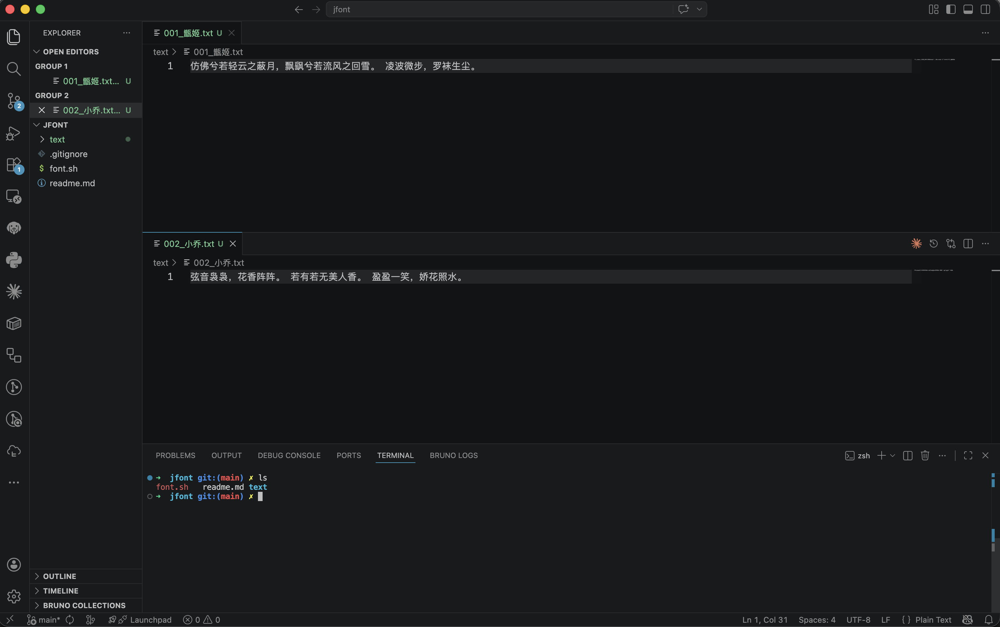
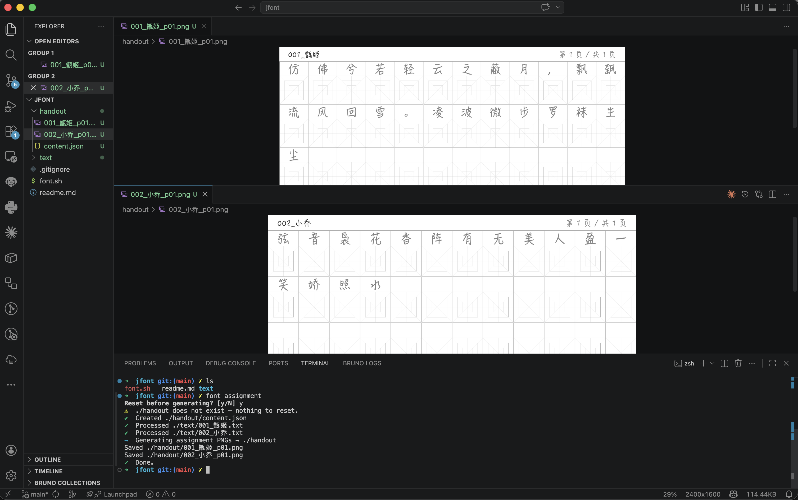
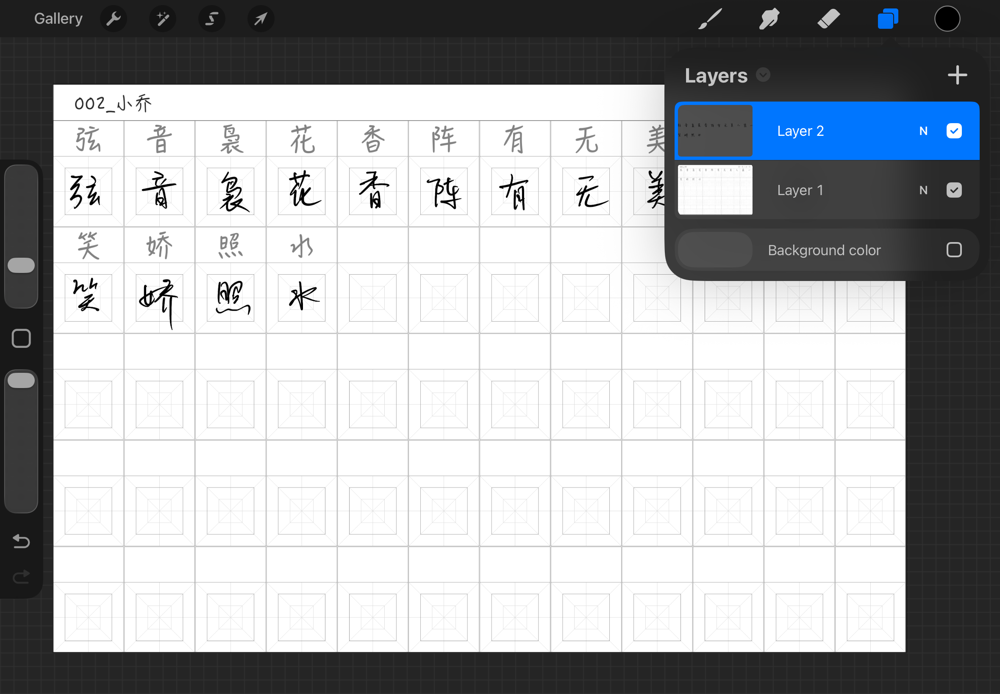
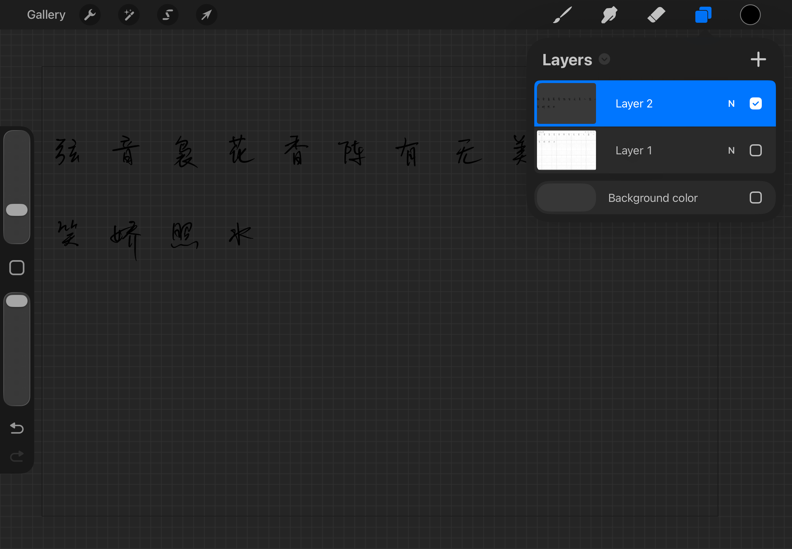
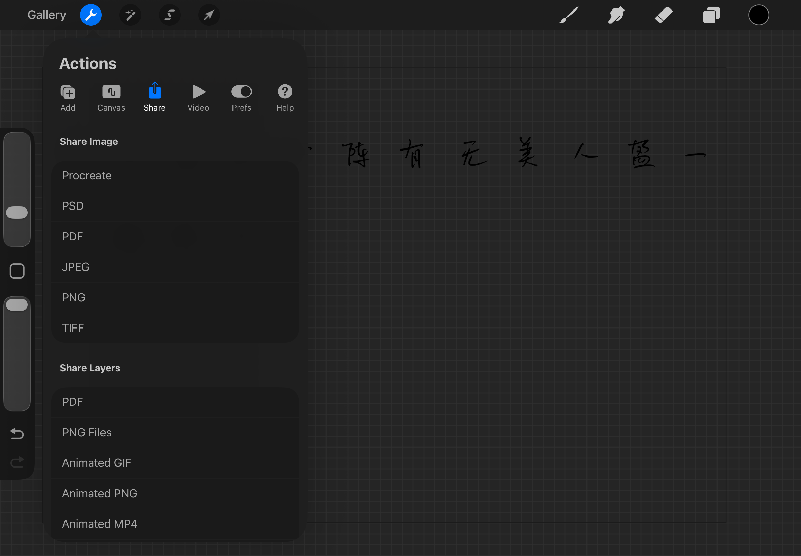
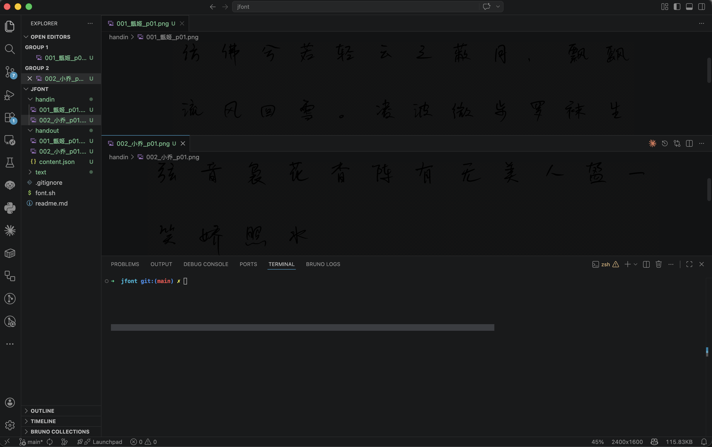
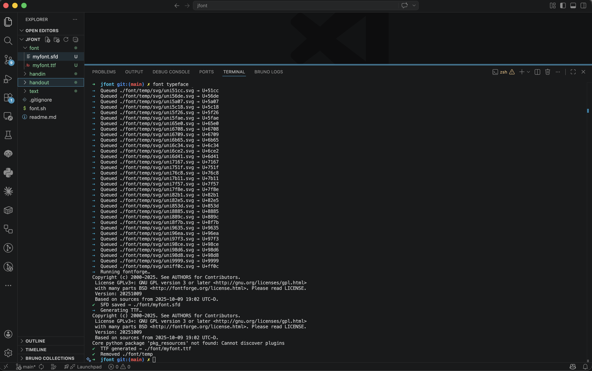
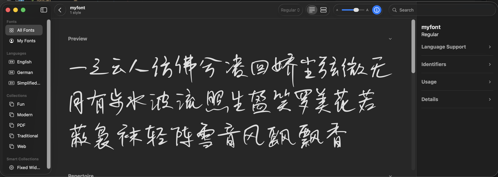
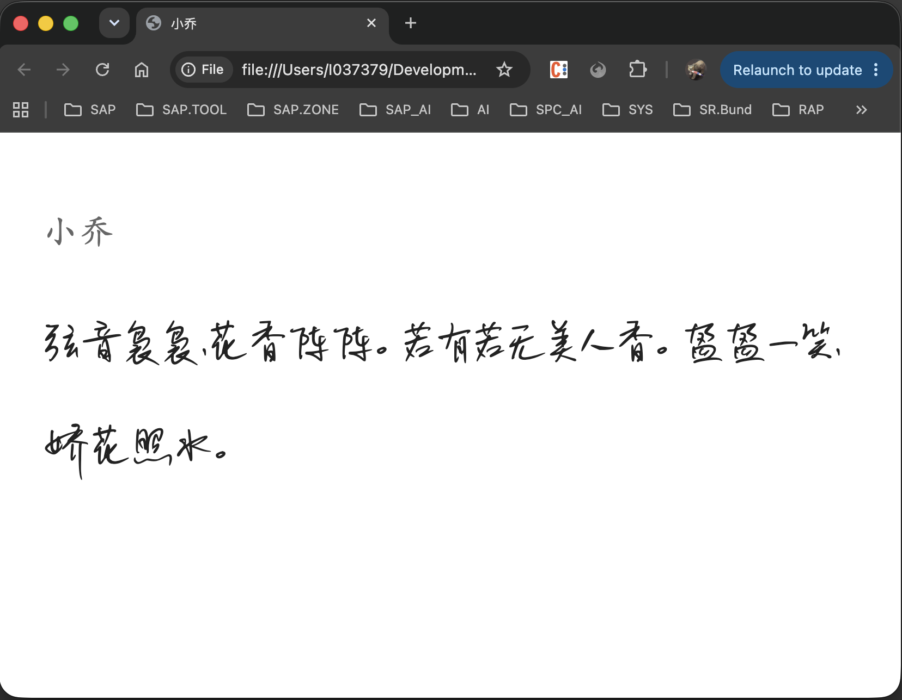
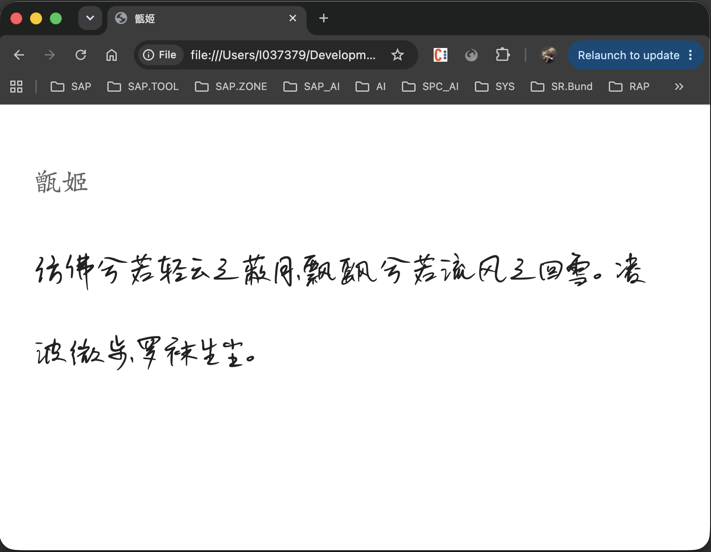

# Tutorial
In this tutorial, default values are used in commands. All folders are under current working folder. 
During usage, you can change default values by parameters, or before source the shell script, change default values in top of the code.
There are more parameters to be used. Result can also accumulate.

## Step 0: Create a Working Folder
Recommended way to organize your folder is one book a folder
font folder and dictionary.json which is record which characters have been in which assignment should be shared through books, so they are recommended be place in parent folder.
```sh
mkdir sample 
cd sample
```

## Step1: Prepare Text
create **/text** folder under current working folder, in this sample I put two text files in.
Note that, for the first 3 chars please DO use number, letters or "_". It is used in json for key


## Step2: Generate Handouts
```sh
font assignment
```
After this command, a **/handout** folder is created, it contains handout **png** sheets and a **json** file containing information for further processing. By default a dictionary.json file will be created in **../font**.


## Step 3: Exercise on ipad
I share the handouts with my daughter in ipad cloud. After she finishing learning, she import the handout sheet to **procreate**, add a new layer to do her exercise.
Note that try to write the character the size of the middle square, dont exceed outter square while bigger than the inner quare.

Then do uncheck the handout sheet layer

Export result as **png** to icloud


## Step 4: Handin
She upload handinsin folder **/handin **


## Step 5: Generate Typeface
```sh
font typeface
```
As a result, font editing file .sfd and final font file .ttf are created in folder **/font**.


## Step 6: Check Font Edit File
Open .sfd with fontforge


## Step 7: Publish Font to System
```sh
font publish system
```
As a result, the generated font is imported to mac system user library


## Step 8: Publish Html with Font
```sh
font publish html
```
As a result, folder **/html** is created, two text are created in html with myfont.



## Step 9: Publish epub
-- function in plan