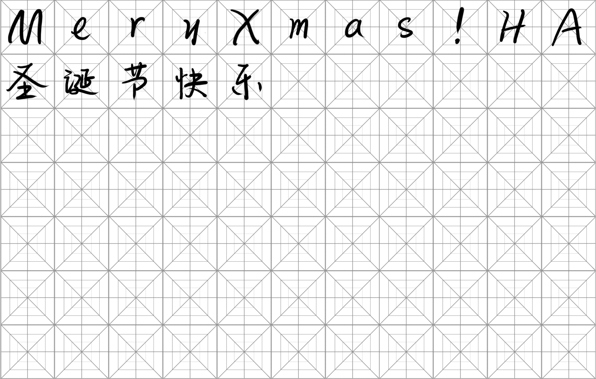
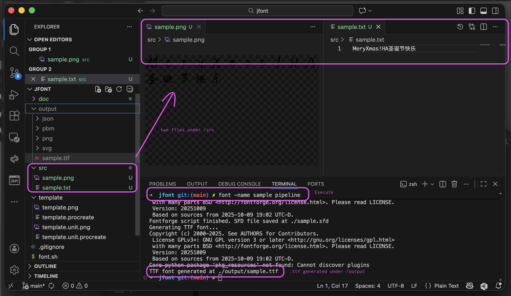
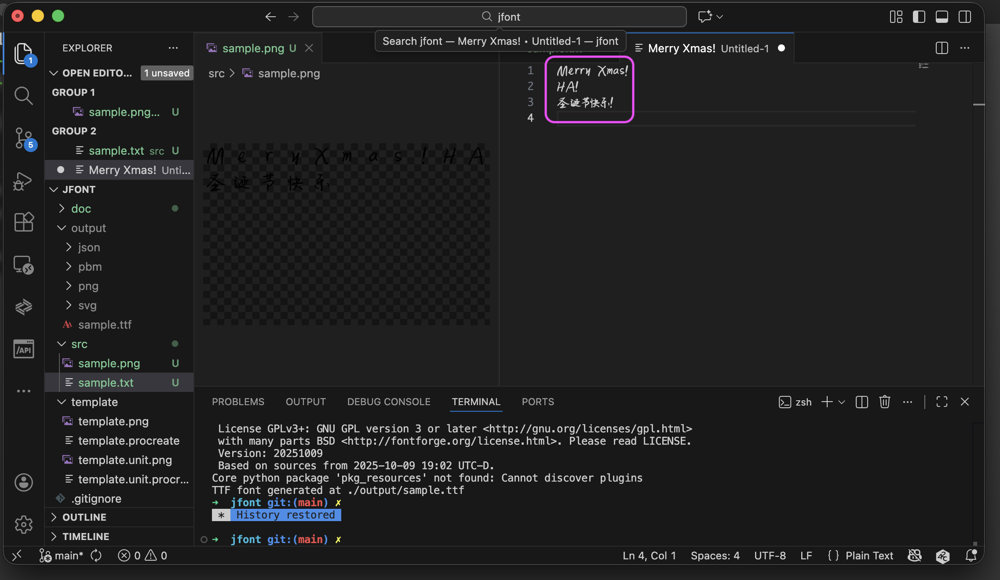

# Purpose
This project provides a shell script that can generate font file .ttf from source png. The script is created in MACOS, MS users need to adapt all commands to fit windows shell.

# Prerequisite
- **perl**, **jq** (usually preinstalled in mac already)
```sh
# install and check
perl --version
jq --version
```
- install [magick](https://github.com/ImageMagick/ImageMagick) 
    - for png processing (cropping, convert to pbm)
    - [install from source](https://imagemagick.org/script/install-source.php#gsc.tab=0)
```sh
# install and check
git clone --depth 1 --branch [latest_release_tag] https://github.com/ImageMagick/ImageMagick.git ImageMagick-7.1.2
cd ImageMagick-7.1.2
./configure
make
sudo make install
magick --version
```
- install [potrace](https://potrace.sourceforge.net/)
    - for pbm to svg conversion
    - [install from source](https://potrace.sourceforge.net/INSTALL) or from brew
```sh
# install and check
brew install potrace
potrace --version
```
- install [fontforge](https://fontforge.org/en-US/) GUI
    - for finetuning
- install [fontforge](https://fontforge.org/en-US/) CLI
    - for batch .svg importing and .ttf generation
    - install from brew
```sh
# install and check
brew install fontforge
fontforge --version
```
- add following command to your .bashrc or "~/.oh-my-zsh/oh-my-zsh.sh"
```sh
# install and check
alias font=<path_to>/font.sh
font --version
```
# How to use 
## Step Description
- create .png file
    - create a canvas size 1400x2200 in procreate
    - import template.png as a layer
    - add a layer and write your font into each 200x200 boxes
    - hide template layer
    - export a png without background and put under /src folder with chosen file name x
    - place .png files under ./src folder
- create .txt file
    - type in all characters in .png files in sequence to .txt files
    - use a same name .as png files and place under /src folder
- for the first time run command "font pipeline"
    - ./output folder is created, under which
        -   /json folder contains json files with all unicodes from .txt file
        - /png folder contains at most n*77 pngs cropped from origin png file and all renamed to unicode correspondingly
        - /pbm folder contains at most n*77 pbm files grayed from png
        - /svg folder contains at most n*77 svg files ready to be imported to font file
    - at root folder .sfd file is created which is the name specified by -name parameter
    - in ./output folder .ttf is created with the same name which is a font file ready to be used
- for repeating run
    - clear /src, replace with new .txt files and .png files
    - delete /output
    - se command "font -name <existing name> pipeline", so font edit file will be change accumulately
    - or you can choose not clear /src folder and generate .ttf with all existing source

## Special Comment
- The template is originally chinese orianted which is "米字格". I add later an assistant square for letters and symbols, now it is called "回米字格".
- By my experience using the template, if the font is created almost exact size of the inner square, generating of .SFD file will scale the font by 1.5 times and move right by 250 pixel. The left and right bearing are set to 50px. Then the size is perfect for using.

## Sample
- Step 1 create a .png in procreate. Note how lowercase/uppercase letters and Chinese characters are placed:

- Step 2 place .png under /src folder.create a .txt file containing the same fonts under the same folder.
- Step 3 run "font -name sample pipeline". As a result we get a sample.ttf file under ./output folder

- Step 5 test by typing.
